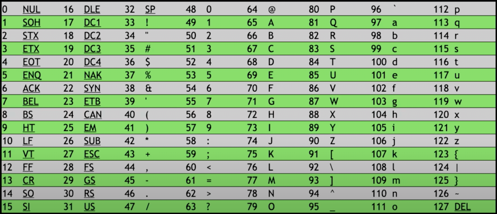

# CS50 - Harvard University

Hey everyone! This repository is part of my **ZERO TO HERO IN MACHINE LEARNING** series.

Some key information about this course:
1. Course Name - [CS50](https://bit.ly/3CKyv5r)
2. Course Instructor - [David J. Malan](https://bit.ly/3Ifrlao)
3. Course Provider/Institute/Organisation - [Harvard University](https://bit.ly/3KJSAf5)
4. Course Availability - [Harvard University Website](https://bit.ly/3CKyv5r)

> NOTE: This course will have all the notes and diagrams from the lectures which I find useful for myself. Please feel free to contribute. Happy Learning!

# Let's begin
---
### WEEK 0

#### What are computers?
- Computers are digital electronic machines that can be programmed to carry out sequences of arithmetic and logical operations.
- Computers are programmable devices that store, retrieve and process data.
- Computers are programmable electronic devices that accept raw data as input and process it with a set of instructions (a program) to produce the result as output.

#### What is Binary Language?
- Computers understand only one language, binary language.
- Binary language of computers is defined as a combination of zeros and ones. Using only zeros and ones, we represent any number that we want.
- Zero and One represent "OFF" and "ON" states in computer.

Example -
Decimal | 0 | 1 | 2 | 3 | 4 | 5 | 6 | 7
--- | --- | --- | --- | --- | --- | --- | --- | --- |
Binary | 000 | 001 | 010 | 011 | 100 | 101 | 110 | 111

##### Why is Decimal System Decimal and why is Binary System Binary?
Let a number be 123 (One Hundred and Twenty Three). We can represent 123 in the form of:
**(100 * 1) + (10 * 2) + (1 * 3)**.
> 'Dec' in decimal means '10'.

Hence, we can represent the number 123 in powers of 10 as well, like:
- **(102 * 1) + (101 * 2) + (100 * 3)**

Similarly, we can represent the binary numbers in the powers of 2, like:
- 011
- => (22 * 0) + (21 * 1) + (20 * 1)
- => (4 * 0) + (2 * 1) + (1 * 1)
- => 0 + 2 + 1
- => 3 (converted binary 011 to decimal equivalent, i.e. 3)
---
### [ASCII - American Standard Code for Information Interchange](https://en.wikipedia.org/wiki/ASCII)
It is a standard code agreed in general by all humans to represent symbols (numbers, letters, punctuation, etc.)
Example:
- 65 to 90 represents 'A' to 'Z'.
- 97 to 122 represents 'a' to 'z'.
- 48 to 57 represents '0' to '9'.

> So when someone sends a message as "HI!", it is actually sent as "72 73 33" which is represented in the form binary language as "1001000 1001001 0100001".

#### ASCII Table from 0 to 127

---

Disadvantage of ASCII:
- Limited character set - With extended ASCII also, we can represent only 256 characters.
- Inefficient character encoding - ASCII encoding is efficient only for English language and numerical data but representing characters from other alphabets require more overhead such as escape codes.

### [Unicode - Alternative of ASCII](https://en.wikipedia.org/wiki/Unicode)
It is an information technology standard for consistent encoding, representation and handling of text expressed in most of the world's writing systems.
> In short, other characters such as letters with accent marks and symbols from other languages are represented by Unicode which uses more bits than ASCII to accommodate all those characters.

Hence, even when we receive an emoji, our computers actually receive a number in binary which is mapped to the image of emoji based on the UNICODE standard.

Example:
The face with medical mask emoji in binary is:
> 11110000 10011111 10011000 10110111

